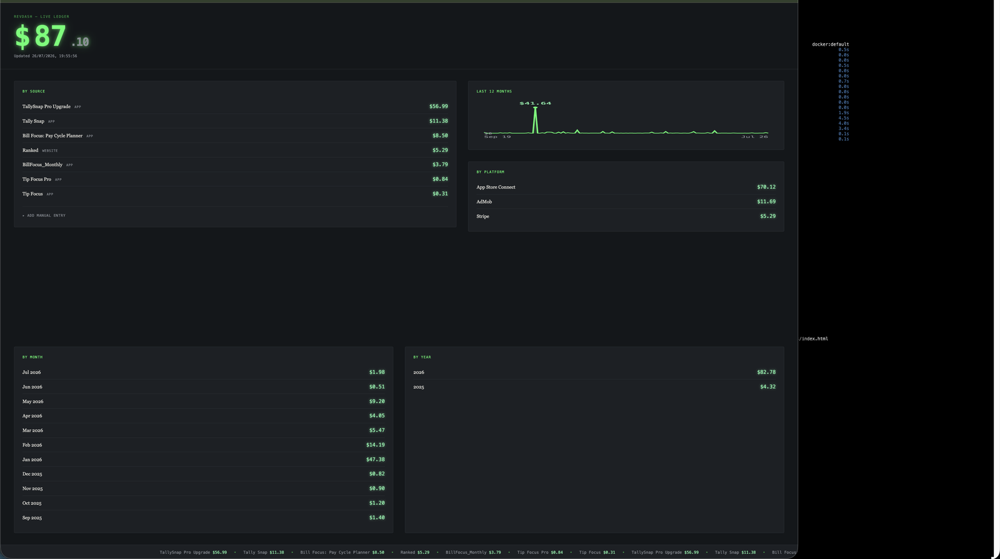

# Revdash

A self-hosted revenue dashboard for indie developers. Tracks income
across every app and website you run, in one place, on your own
hardware -- your financial data and API credentials never leave your
own server.



## Why this exists

Most revenue dashboards are SaaS -- you hand a third party your
Stripe keys, your App Store Connect credentials, your AdMob access,
and trust them to keep it safe. Revdash is the opposite: it's a
small Flask app you run yourself, alongside sync scripts (see
[revdash/integrations](https://github.com/revdash/integrations))
that pull data from Apple, Stripe, and AdMob directly into your own
database. Nothing passes through anyone else's servers.

## Features

- Live total, updated automatically
- Per-source and per-platform breakdown (know at a glance whether
  App Store, Stripe, or AdMob is actually driving your revenue)
- Trailing 12-month trend chart with peak/date labels
- By-month and by-year history
- Manual income entry for anything not yet automated, with per-entry
  delete
- Optional password protection (HTTP Basic Auth)
- Designed to look good on a wall-mounted display, not just a laptop

## Setup

1. Clone this repo onto your server:
   ```
   git clone https://github.com/revdash/revenue-dashboard.git
   cd revenue-dashboard
   ```

2. Build and run:
   ```
   docker build -t revdash .
   docker run -d --name revdash --restart unless-stopped \
     -p 8420:8420 \
     -v $(pwd)/data:/data \
     revdash
   ```

3. Open `http://YOUR_SERVER_IP:8420`

## Optional: password protection

By default the dashboard is open to anyone on your network. To
require a login:

```
docker run -d --name revdash --restart unless-stopped \
  -p 8420:8420 \
  -v $(pwd)/data:/data \
  -e DASHBOARD_USER=youruser \
  -e DASHBOARD_PASSWORD=yourpassword \
  revdash
```

This is plain HTTP Basic Auth -- fine for LAN traffic, not something
to expose to the internet without HTTPS in front of it.

## Backing up your data

Your revenue history lives in `data/income.db`. Run `backup_db.sh`
on a daily cron to keep dated backups -- see that script for setup.
This matters: unlike the App Store/AdMob integrations, some data
(manual entries, thin Stripe history) may not be re-fetchable if
lost.

## Connecting real revenue sources

See [revdash/integrations](https://github.com/revdash/integrations)
for the App Store Connect, Stripe, and AdMob sync scripts. Each
posts to this dashboard's `/api/income` endpoint on a daily schedule.

## License

Source-available, no resale/rehosting. See
[revdash/unraid-agent](https://github.com/revdash/unraid-agent) for
the full license text (same terms apply across the project).
